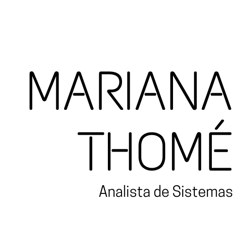

    
    
  

   
   

## Hi there! Eu sou a Mariana! :vulcan_salute:  

### Sobre mim:
  

  
  
 - :woman_student: Estudante de Análise e Desenvolvimento de Sistemas pela Fatec, 4˚ ciclo; 

  
 - :books: Skills em construção: HTML, CSS, JavaScript, Angular, NodeJs, SQL; 

  
 - :wheelchair: PCD; 

  
 - :nerd_face: Apaixonada por Música, Beisebol e Star Trek; 

  

### Contatos:

 
 

<h1 align="center">
  
</h1>

<h1 align="center">
    
</h1>

  <a href="#-tecnologias">Tecnologias</a>&nbsp;&nbsp;&nbsp;|&nbsp;&nbsp;&nbsp;
  <a href="#-projeto">Projeto</a>&nbsp;&nbsp;&nbsp;|&nbsp;&nbsp;&nbsp;

 

  

 

## 🚀 Tecnologias

Esse projeto foi desenvolvido com as seguintes tecnologias:

- HTML
- CSS
- PHP
- SQL

## 💻 Projeto

Projeto desenvolvido para a disciplina de Laboratório de Banco de Dados. É um site para compartilhamento de mudas de plantas. 
